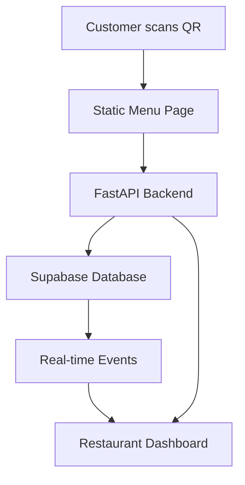

# Design Document

## Overview

The multi-tenant QR-code ordering system is designed as a modern SaaS platform that enables restaurants to provide self-service ordering experiences to their dine-in customers. The system consists of two main applications: a lightweight static customer menu page and a comprehensive restaurant dashboard built with FastAPI and Reflex. The architecture emphasizes data isolation, real-time communication, and scalable multi-tenancy through Supabase's PostgreSQL database with Row-Level Security (RLS).

## Architecture

### System Components

The system follows a microservices-inspired architecture with clear separation of concerns:

1. **Customer Menu Application** (Static Website)
   - Hosted on Hostinger
   - Pure HTML/CSS/JavaScript
   - Communicates with backend via REST API
   - Lightweight and fast-loading

2. **Restaurant Dashboard Application** (FastAPI + Reflex)
   - FastAPI backend serving REST APIs
   - Reflex frontend for restaurant management
   - Real-time WebSocket connections
   - Authentication and authorization

3. **Database Layer** (Supabase)
   - PostgreSQL with Row-Level Security
   - Real-time subscriptions
   - Built-in authentication
   - Automatic API generation

### Communication Flow



### Multi-Tenancy Strategy

The system implements tenant isolation through:
- **Database Level**: Row-Level Security policies on all tables
- **Application Level**: restaurant_id validation in all API endpoints
- **Authentication Level**: JWT tokens with restaurant context
- **API Level**: Middleware for automatic tenant filtering

## Components and Interfaces

### Database Schema

#### Core Tables

**restaurants**
```sql
CREATE TABLE restaurants (
    id UUID PRIMARY KEY DEFAULT gen_random_uuid(),
    name VARCHAR(255) NOT NULL,
    owner_id UUID REFERENCES auth.users(id),
    created_at TIMESTAMP WITH TIME ZONE DEFAULT NOW()
);
```

**menu_items**
```sql
CREATE TABLE menu_items (
    id UUID PRIMARY KEY DEFAULT gen_random_uuid(),
    restaurant_id UUID REFERENCES restaurants(id),
    name VARCHAR(255) NOT NULL,
    description TEXT,
    price DECIMAL(10,2) NOT NULL,
    category VARCHAR(100),
    image_url TEXT,
    is_available BOOLEAN DEFAULT true,
    created_at TIMESTAMP WITH TIME ZONE DEFAULT NOW()
);
```

**orders**
```sql
CREATE TABLE orders (
    id UUID PRIMARY KEY DEFAULT gen_random_uuid(),
    restaurant_id UUID REFERENCES restaurants(id),
    table_number INTEGER NOT NULL,
    customer_name VARCHAR(255),
    customer_phone VARCHAR(20),
    order_status order_status_enum DEFAULT 'pending',
    total_price DECIMAL(10,2) NOT NULL,
    payment_method VARCHAR(50) DEFAULT 'cash',
    created_at TIMESTAMP WITH TIME ZONE DEFAULT NOW()
);

CREATE TYPE order_status_enum AS ENUM (
    'pending', 'confirmed', 'in_progress', 'ready', 'completed', 'canceled'
);
```

**order_items**
```sql
CREATE TABLE order_items (
    id UUID PRIMARY KEY DEFAULT gen_random_uuid(),
    order_id UUID REFERENCES orders(id),
    menu_item_id UUID REFERENCES menu_items(id),
    quantity INTEGER NOT NULL CHECK (quantity > 0),
    unit_price DECIMAL(10,2) NOT NULL
);
```

**customer_profiles**
```sql
CREATE TABLE customer_profiles (
    id UUID PRIMARY KEY DEFAULT gen_random_uuid(),
    restaurant_id UUID REFERENCES restaurants(id),
    phone_number VARCHAR(20) NOT NULL,
    name VARCHAR(255),
    last_order_at TIMESTAMP WITH TIME ZONE,
    UNIQUE(restaurant_id, phone_number)
);
```

#### Row-Level Security Policies

```sql
-- Enable RLS on all tables
ALTER TABLE restaurants ENABLE ROW LEVEL SECURITY;
ALTER TABLE menu_items ENABLE ROW LEVEL SECURITY;
ALTER TABLE orders ENABLE ROW LEVEL SECURITY;
ALTER TABLE order_items ENABLE ROW LEVEL SECURITY;
ALTER TABLE customer_profiles ENABLE ROW LEVEL SECURITY;

-- Restaurant owners can only access their own restaurant
CREATE POLICY restaurant_isolation ON restaurants
    FOR ALL USING (owner_id = auth.uid());

-- Menu items are isolated by restaurant_id
CREATE POLICY menu_items_isolation ON menu_items
    FOR ALL USING (
        restaurant_id IN (
            SELECT id FROM restaurants WHERE owner_id = auth.uid()
        )
    );

-- Orders are isolated by restaurant_id
CREATE POLICY orders_isolation ON orders
    FOR ALL USING (
        restaurant_id IN (
            SELECT id FROM restaurants WHERE owner_id = auth.uid()
        )
    );
```

### API Endpoints Design

#### Authentication Endpoints

**POST /api/auth/register**
```python
class RegisterRequest(BaseModel):
    email: str
    password: str
    restaurant_name: str

class RegisterResponse(BaseModel):
    user_id: str
    restaurant_id: str
    access_token: str
```

**POST /api/auth/login**
```python
class LoginRequest(BaseModel):
    email: str
    password: str

class LoginResponse(BaseModel):
    access_token: str
    restaurant_id: str
    expires_in: int
```

#### Public Endpoints (Customer Menu)

**GET /api/menus/{restaurant_id}**
```python
class MenuItemResponse(BaseModel):
    id: str
    name: str
    description: str
    price: Decimal
    category: str
    image_url: Optional[str]
    is_available: bool

class MenuResponse(BaseModel):
    restaurant_name: str
    items: List[MenuItemResponse]
```

#### Order Management Endpoints

**POST /api/orders**
```python
class OrderItemRequest(BaseModel):
    menu_item_id: str
    quantity: int

class CreateOrderRequest(BaseModel):
    restaurant_id: str
    table_number: int
    customer_name: str
    customer_phone: str
    items: List[OrderItemRequest]

class OrderResponse(BaseModel):
    id: str
    order_number: str
    order_status: str
    total_price: Decimal
    estimated_time: Optional[int]
    payment_method: str
```

**GET /api/orders/live**
- WebSocket endpoint for real-time order updates
- Authenticated endpoint for restaurant dashboard
- Streams order creation and status changes

**PUT /api/orders/{order_id}**
```python
class UpdateOrderRequest(BaseModel):
    order_status: str
    estimated_time: Optional[int]
```

#### Dashboard Management Endpoints

**GET /api/dashboard/analytics**
```python
class AnalyticsResponse(BaseModel):
    total_orders: int
    total_revenue: Decimal
    average_order_value: Decimal
    best_selling_items: List[MenuItemStats]
    orders_by_hour: Dict[str, int]
    date_range: DateRange
```

**CRUD /api/dashboard/menu**
- GET /api/dashboard/menu - List all menu items
- POST /api/dashboard/menu - Create new menu item
- PUT /api/dashboard/menu/{item_id} - Update menu item
- DELETE /api/dashboard/menu/{item_id} - Delete menu item

### Real-Time Communication

#### Supabase Real-time Integration

```python
class RealtimeService:
    def __init__(self, supabase_client):
        self.client = supabase_client
        
    def subscribe_to_orders(self, restaurant_id: str, callback):
        """Subscribe to order changes for a specific restaurant"""
        return self.client.table('orders').on('*', callback).filter(
            'restaurant_id', 'eq', restaurant_id
        ).subscribe()
        
    def publish_order_update(self, order_id: str, status: str):
        """Publish order status update"""
        self.client.table('orders').update({
            'order_status': status,
            'updated_at': 'now()'
        }).eq('id', order_id).execute()
```

#### WebSocket Implementation

```python
class OrderWebSocket:
    def __init__(self):
        self.connections: Dict[str, List[WebSocket]] = {}
        
    async def connect(self, websocket: WebSocket, restaurant_id: str):
        await websocket.accept()
        if restaurant_id not in self.connections:
            self.connections[restaurant_id] = []
        self.connections[restaurant_id].append(websocket)
        
    async def broadcast_order_update(self, restaurant_id: str, order_data: dict):
        if restaurant_id in self.connections:
            for connection in self.connections[restaurant_id]:
                await connection.send_json(order_data)
```

## Data Models

### Core Domain Models

```python
from pydantic import BaseModel, validator
from decimal import Decimal
from datetime import datetime
from typing import Optional, List
from enum import Enum

class OrderStatus(str, Enum):
    PENDING = "pending"
    CONFIRMED = "confirmed"
    IN_PROGRESS = "in_progress"
    READY = "ready"
    COMPLETED = "completed"
    CANCELED = "canceled"

class PaymentMethod(str, Enum):
    CASH = "cash"
    CARD = "card"

class Restaurant(BaseModel):
    id: str
    name: str
    owner_id: str
    created_at: datetime

class MenuItem(BaseModel):
    id: str
    restaurant_id: str
    name: str
    description: Optional[str]
    price: Decimal
    category: str
    image_url: Optional[str]
    is_available: bool = True
    
    @validator('price')
    def price_must_be_positive(cls, v):
        if v <= 0:
            raise ValueError('Price must be positive')
        return v

class Order(BaseModel):
    id: str
    restaurant_id: str
    table_number: int
    customer_name: str
    customer_phone: str
    order_status: OrderStatus
    payment_method: PaymentMethod
    total_price: Decimal
    created_at: datetime
    items: List['OrderItem']
    
    @validator('table_number')
    def table_number_must_be_positive(cls, v):
        if v <= 0:
            raise ValueError('Table number must be positive')
        return v

class OrderItem(BaseModel):
    id: str
    order_id: str
    menu_item_id: str
    quantity: int
    unit_price: Decimal
    
    @validator('quantity')
    def quantity_must_be_positive(cls, v):
        if v <= 0:
            raise ValueError('Quantity must be positive')
        return v

class CustomerProfile(BaseModel):
    id: str
    restaurant_id: str
    phone_number: str
    name: str
    last_order_at: Optional[datetime]
```

### Service Layer Models

```python
class OrderService:
    def __init__(self, db_client, realtime_service):
        self.db = db_client
        self.realtime = realtime_service
    
    async def create_order(self, order_request: CreateOrderRequest) -> Order:
        # Validate menu items and calculate total
        # Create order and order items with cash payment method
        # Generate order number for customer reference
        # Trigger real-time notification to restaurant dashboard
        pass
    
    async def update_order_status(self, order_id: str, status: OrderStatus) -> Order:
        # Update order status
        # Trigger real-time notification
        pass

class MenuService:
    def __init__(self, db_client):
        self.db = db_client
    
    async def get_public_menu(self, restaurant_id: str) -> List[MenuItem]:
        # Return only available items for public menu
        pass
    
    async def manage_menu_item(self, restaurant_id: str, item_data: dict) -> MenuItem:
        # CRUD operations with restaurant isolation
        pass
```

## Error Handling

### Exception Hierarchy

```python
class QROrderingException(Exception):
    """Base exception for QR ordering system"""
    pass

class AuthenticationError(QROrderingException):
    """Authentication related errors"""
    pass

class AuthorizationError(QROrderingException):
    """Authorization related errors"""
    pass

class ValidationError(QROrderingException):
    """Data validation errors"""
    pass


class DatabaseError(QROrderingException):
    """Database operation errors"""
    pass
```

### Error Response Format

```python
class ErrorResponse(BaseModel):
    error_code: str
    message: str
    details: Optional[dict] = None
    timestamp: datetime

# Example error responses
{
    "error_code": "INVALID_TABLE_NUMBER",
    "message": "Table number must be provided and valid",
    "details": {"table_number": "required"},
    "timestamp": "2024-01-15T10:30:00Z"
}

{
    "error_code": "ORDER_CREATION_FAILED",
    "message": "Unable to create order",
    "details": {"validation_errors": ["invalid_menu_item_id"]},
    "timestamp": "2024-01-15T10:30:00Z"
}
```

### Global Exception Handler

```python
@app.exception_handler(QROrderingException)
async def qr_ordering_exception_handler(request: Request, exc: QROrderingException):
    return JSONResponse(
        status_code=400,
        content=ErrorResponse(
            error_code=exc.__class__.__name__.upper(),
            message=str(exc),
            timestamp=datetime.utcnow()
        ).dict()
    )
```

## User Interface Design

### Dashboard Layout (Based on Reference UI)

The restaurant dashboard will follow the clean, modern design pattern shown in the reference UI with the following key components:

#### Navigation Sidebar
- **Primary Navigation**: Dashboard, Orders, Menu, Customers, Tables, Staff
- **Analytics Section**: Sales Reports, Inventory, Revenue
- **Management Section**: Settings, Promotions
- **Color Scheme**: Orange primary (#FF6B35), neutral grays, clean white background
- **Icons**: Consistent iconography for each navigation item

#### Main Dashboard Components

**Key Metrics Cards (Top Row)**
```
┌─────────────┬─────────────┬─────────────┬─────────────┐
│ Revenue     │ Orders      │ Customers   │ Avg Rating  │
│ $4,287      │ 127         │ 89          │ 4.8         │
│ +12.5%      │ +8.2%       │ +15.3%      │ +0.3        │
└─────────────┴─────────────┴─────────────┴─────────────┘
```

**Revenue Overview Chart**
- Line chart showing revenue trends over 7D/30D/90D periods
- Orange gradient fill matching brand colors
- Interactive time period selector

**Order Status Visualization**
- Circular progress chart showing order completion rates
- Color-coded status indicators:
  - Green: Completed orders
  - Orange: In Progress orders  
  - Red: Pending orders

**Recent Orders List**
- Table-based layout with order details
- Status badges with appropriate colors
- Table numbers prominently displayed
- Order totals and item counts

**Popular Items Today**
- Menu item cards with images
- Sales count and percentage indicators
- Price display with trend arrows

**Table Status Grid**
- Visual table layout (T1, T2, T3, etc.)
- Color-coded status:
  - Green: Available
  - Red: Occupied
  - Yellow: Reserved
  - Gray: Out of service

#### Reflex Component Structure

```python
# Main dashboard layout
def dashboard_page() -> rx.Component:
    return rx.vstack(
        # Header with welcome message and export button
        dashboard_header(),
        
        # Key metrics row
        rx.hstack(
            metric_card("Revenue", "$4,287", "+12.5%", "green"),
            metric_card("Orders", "127", "+8.2%", "blue"), 
            metric_card("Customers", "89", "+15.3%", "purple"),
            metric_card("Rating", "4.8", "+0.3", "orange"),
            spacing="4",
            width="100%"
        ),
        
        # Charts and analytics row
        rx.hstack(
            revenue_chart(),
            order_status_chart(),
            spacing="4",
            width="100%"
        ),
        
        # Recent orders and popular items
        rx.hstack(
            recent_orders_table(),
            popular_items_list(),
            spacing="4", 
            width="100%"
        ),
        
        # Table status grid
        table_status_grid(),
        
        spacing="6",
        padding="6"
    )

def metric_card(title: str, value: str, change: str, color: str) -> rx.Component:
    return rx.card(
        rx.vstack(
            rx.hstack(
                rx.icon(tag="dollar_sign", color=color),
                rx.text(change, color="green", font_size="sm"),
                justify="between"
            ),
            rx.text(value, font_size="2xl", font_weight="bold"),
            rx.text(title, color="gray", font_size="sm"),
            spacing="2"
        ),
        padding="4",
        border_radius="lg",
        box_shadow="sm"
    )
```

#### Color Palette
- **Primary Orange**: #FF6B35 (buttons, highlights, active states)
- **Success Green**: #10B981 (completed orders, positive metrics)
- **Warning Yellow**: #F59E0B (pending orders, reserved tables)
- **Error Red**: #EF4444 (cancelled orders, occupied tables)
- **Neutral Gray**: #6B7280 (text, borders)
- **Light Gray**: #F9FAFB (backgrounds, cards)
- **White**: #FFFFFF (main background)

#### Typography
- **Headers**: Inter/System font, bold weights
- **Body Text**: Inter/System font, regular weights
- **Numbers/Metrics**: Tabular numbers for alignment
- **Font Sizes**: Consistent scale (sm, base, lg, xl, 2xl)

#### Interactive Elements
- **Buttons**: Rounded corners, hover states, consistent padding
- **Cards**: Subtle shadows, hover effects for interactive elements
- **Status Badges**: Rounded pills with appropriate colors
- **Form Inputs**: Clean borders, focus states

#### Responsive Design
- **Desktop**: Full sidebar navigation, multi-column layouts
- **Tablet**: Collapsible sidebar, stacked metric cards
- **Mobile**: Bottom navigation, single column layout

### Customer Menu Page Design

The static customer menu page will have a complementary but simplified design:

- **Header**: Restaurant name and table number input
- **Menu Categories**: Horizontal scrolling category tabs
- **Menu Items**: Card-based layout with images, descriptions, prices
- **Cart**: Floating cart button with item count
- **Checkout**: Simple form with customer details and order confirmation

## Testing Strategy

### Unit Testing

- **Models**: Validate data models, constraints, and business logic
- **Services**: Test business logic with mocked dependencies
- **API Endpoints**: Test request/response handling and validation
- **Database Operations**: Test queries and RLS policies

### Integration Testing

- **Database Integration**: Test with real Supabase instance
- **Real-time Features**: Test WebSocket connections and Supabase subscriptions
- **Authentication Flow**: End-to-end auth testing

### End-to-End Testing

- **Customer Journey**: Complete order flow from QR scan to completion
- **Restaurant Dashboard**: Order management and real-time updates
- **Multi-tenant Isolation**: Verify data separation between restaurants

### Testing Tools and Framework

```python
# pytest configuration
pytest_plugins = [
    "pytest_asyncio",
    "pytest_mock",
]

# Test fixtures
@pytest.fixture
async def test_client():
    async with AsyncClient(app=app, base_url="http://test") as ac:
        yield ac

@pytest.fixture
def mock_supabase():
    with patch('app.database.supabase_client') as mock:
        yield mock

# Example test
async def test_create_order_success(test_client, mock_supabase):
    order_data = {
        "restaurant_id": "test-restaurant-id",
        "table_number": 5,
        "customer_name": "John Doe",
        "customer_phone": "+1234567890",
        "items": [{"menu_item_id": "item-1", "quantity": 2}]
    }
    
    response = await test_client.post("/api/orders", json=order_data)
    assert response.status_code == 201
    assert response.json()["order_status"] == "pending"
```

### Performance Testing

- **Load Testing**: Simulate concurrent orders and dashboard usage
- **Database Performance**: Test query performance with large datasets
- **Real-time Scalability**: Test WebSocket connection limits
- **API Response Times**: Ensure sub-200ms response times for critical endpoints